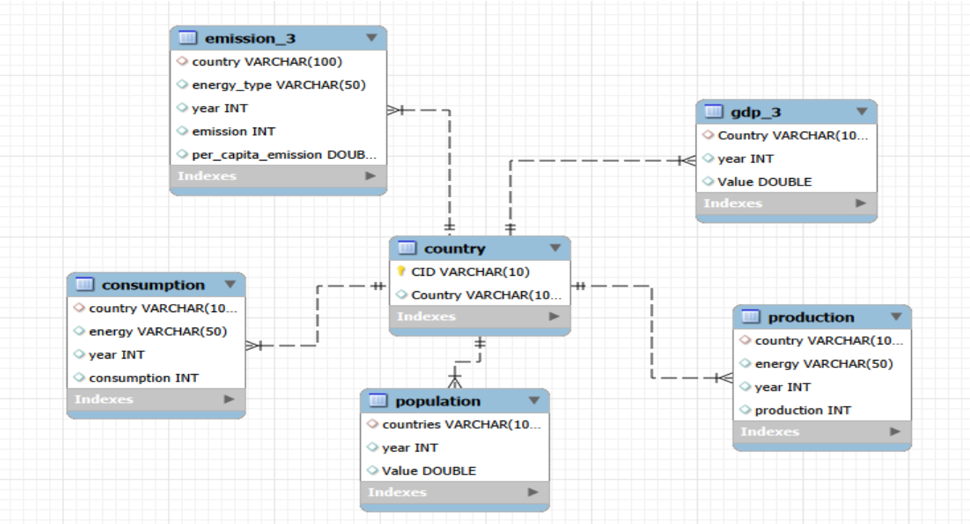

# Energy Consumption Analysis Using SQL

## Project Overview

This is a comprehensive SQL database project that analyzes global patterns in energy production, consumption, emissions, GDP, and population trends across multiple countries from 2020 to 2023. The project transforms raw data into meaningful insights that support sustainable decision-making and environmental performance evaluation.

## Objective

The main objective of this project is to understand global energy and environmental patterns by creating and analyzing a complete SQL database. Through structured relational data and advanced SQL queries, we examine:

- How different countries produce and consume energy
- How emissions change over time
- The relationship between population growth and environmental impact
- How economic factors like GDP relate to energy usage
- Trends in energy types contributing to emissions

## Project Structure

### Database Schema

The project is built on a normalized relational database with the following tables:

- **Country**: Master table containing country information
- **Emission**: Annual CO2 emissions data by country
- **Population**: Population statistics by country and year
- **Production**: Energy production data by type and country
- **Consumption**: Energy consumption data by country and year
- **GDP**: Gross Domestic Product data by country and year

### ER Diagram

The database implements a one-to-many relationship structure where the Country table acts as the master record, connecting to multiple rows in emission, population, production, consumption, and GDP tables through foreign key relationships.

## Key Analysis & Insights

### Analysis Questions Covered

1. **Emissions Analysis**
   - Total emission per country for the most recent year
   - Energy types that contributed most to emissions across countries
   - Change in global emissions over the years
   - Average yearly change in emissions per capita for each country
   - Emission-to-GDP ratio for each country by year
   - Global share of emissions by country

2. **Energy Consumption Trends**
   - Change in energy consumption over the years for major economies
   - Countries with highest energy consumption for their relative GDP
   - Comparison of energy production vs. consumption by country

3. **Economic & Population Impact**
   - Top 5 countries by GDP in the most recent year
   - Trend in GDP for each country over the given years
   - Top 10 countries by population and their respective emissions
   - Change in total emissions in each country by population growth
   - Global average GDP, emission, and population by year

## Key Insights

This SQL analysis reveals:

- **High-Emission Countries**: Identification of the largest emitters globally
- **Energy-Economic Connection**: Strong correlation between energy consumption and economic growth
- **Population Pressure**: Direct relationship between population levels and environmental pressure
- **Energy Mix Impact**: Significant variation in emissions based on energy sources used
- **Sustainability Indicators**: Emission-to-GDP ratios highlighting efficiency of different economies

## Technologies & Tools

- **Database**: SQL (MySQL/PostgreSQL compatible)
- **Data Analysis**: Advanced SQL queries including aggregations, joins, and window functions
- **Visualization**: ER diagrams for schema representation
- **Project Documentation**: Comprehensive analysis reports and presentation materials

## Files Included

- `database_schema.sql` - Database creation and table definitions
- `analysis_queries.sql` - Comprehensive analysis SQL queries
- `ER_diagram.png` - Entity-relationship diagram
- `README.md` - Project documentation
- `Presentation_Slides` - Project presentation materials

## Data Range

- **Time Period**: 2020-23
- **Geographic Coverage**: Multiple countries across all continents
- **Metrics**: Emissions (CO2), Energy Production, Energy Consumption, GDP, Population

## How to Use This Project

1. **Setup Database**: Execute `database_schema.sql` to create the database and tables
2. **Load Data**: Import the provided data files into respective tables
3. **Run Analysis**: Execute the queries in `analysis_queries.sql` to generate insights
4. **Review Results**: Examine the output for sustainability patterns and trends
5. **Customize**: Modify queries for specific countries, time periods, or metrics

## Use Cases

- Environmental policy makers evaluating emission trends
- Energy companies analyzing consumption patterns
- Sustainability analysts comparing countries' environmental performance
- Researchers studying the relationship between economic growth and emissions
- Educational institutions teaching SQL and data analysis

## Conclusion

This project demonstrates how organized data and structured analysis can transform raw global statistics into actionable insights. The analysis highlights the importance of:

- Transitioning to clean energy sources
- Implementing efficient resource utilization
- Balancing economic development with environmental sustainability
- Supporting data-driven decision-making in environmental policy

## License

This project is available for educational and research purposes.

## Contact & Support

For questions or suggestions about this project, feel free to open an issue or contact the project authors through GitHub.

---

*Last Updated: December 2025*
